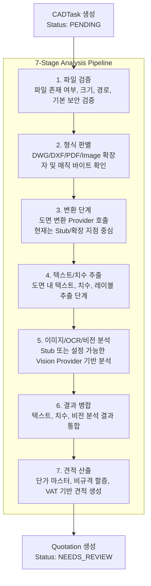

# CAD/DWG Estimate Application - System Architecture & Feature Definition

본 문서는 **CAD/DWG 도면 기반 가구 수량 분석 및 견적 자동화 솔루션**의 서비스 목적, 시스템 구조, 분석 파이프라인, 데이터 모델, 백엔드/프론트엔드 기능, 샘플 데이터 검증 정책을 정리한 설명서입니다.

이 서비스는 건설 현장의 주방가구/수납가구 도면과 발주서 데이터를 기반으로 프로젝트, 평형, BOM, 동별 수량, 견적서를 통합 관리하는 업무용 웹 애플리케이션입니다. 현재 구현은 실제 CAD/AI 분석 엔진을 완전히 대체하는 상용 분석기라기보다, **파일 보안 업로드, 발주서 파싱, 샘플 검증, 견적 산출, 수동 검토 UI, Stub/Provider 기반 분석 파이프라인**을 갖춘 파일럿/데모 시스템입니다.

---

## 1. 전체 시스템 구성도

서비스는 크게 다음 구성 요소로 이루어집니다.

- **React SPA Frontend**
  - 프로젝트, 평형, BOM, 동별 수량, 견적서, 분석 상태를 조회하고 관리하는 웹 UI입니다.
  - 개발자/검증 도구 영역에서 샘플 데이터셋 상태를 확인하고, 로컬 샘플 발주서 임포트 및 Golden Dataset 평가를 실행할 수 있습니다.

- **FastAPI Backend**
  - 프로젝트/BOM/견적 API, 파일 업로드 API, 샘플 데이터 API, 상태/헬스체크 API를 제공합니다.
  - 업로드 파일 검증, path traversal 방어, 샘플 파일 보안 검증, P/O XLSX 파싱, 견적 계산 흐름을 담당합니다.

- **SQLite Database**
  - 프로젝트, 평형, BOM, 동별 수량, 견적서, 견적 항목, 수정 이력, 단가 마스터를 저장합니다.
  - 로컬 개발/파일럿 환경을 기준으로 동작하며, 마이그레이션 스크립트를 통해 스키마를 보강할 수 있습니다.

- **Local File Storage**
  - 사용자가 업로드한 도면 파일과 파이프라인 산출물을 로컬 `uploads/` 폴더에 저장합니다.
  - 고객사 도면 원본과 대용량 DWG 샘플은 Git에 포함하지 않고 로컬 또는 보안 저장소에서만 관리합니다.

- **Sample Manifest & Golden Fixtures**
  - `sample/manifest.json`은 검증용 샘플의 메타데이터를 정의합니다.
  - 공개 가능한 기존 fixture와 synthetic fixture는 Git에 포함합니다.
  - 민감한 신규 샘플 XLSX와 해당 파일에서 파생한 Golden JSON은 Git에 커밋하지 않고, 로컬에 존재할 때만 추가 검증합니다.

### 파일 보안 및 형상 관리 정책

- **DWG 원본 Git 제외**
  - DWG는 설계 도면 원본이므로 Git 추적 대상에서 제외합니다.
  - `.gitignore`의 `*.dwg` 규칙으로 신규 DWG 추가를 차단합니다.
  - 기존에 추적되던 DWG도 Git 인덱스에서 제거하고, 로컬 파일은 삭제하지 않습니다.

- **민감 XLSX 및 파생 Golden JSON 제외**
  - 신규 현장 샘플의 원본 발주서 XLSX와 해당 파일에서 생성한 Golden JSON은 외부 저장소로 반출하지 않습니다.
  - 로컬에 파일이 있으면 심화 회귀 테스트를 수행하고, 없으면 CI 안정성을 위해 optional 처리합니다.

- **CI용 Synthetic Fixture**
  - 민감 데이터가 없어도 테스트가 동작하도록 synthetic Golden Fixture를 둡니다.
  - 이를 통해 샘플 데이터셋 구조와 평가 스키마를 외부 환경에서도 안전하게 검증할 수 있습니다.

---

## 2. 7단계 분석 파이프라인

도면 파일이 업로드되면 백엔드는 `CADTask`를 생성하고, 분석 파이프라인을 통해 파일 검증부터 견적 생성까지의 흐름을 실행합니다. 현재 파이프라인은 실제 CAD/AI 분석을 완성한 상태라기보다, 단계별 책임과 Provider 교체 지점을 명확히 둔 구조입니다.



### 단계별 역할

1. **파일 검증**
   - 파일이 실제로 존재하는지 확인합니다.
   - 업로드 경로와 파일 크기, 허용 확장자를 검증합니다.

2. **형식 판별**
   - 확장자뿐 아니라 파일 헤더의 매직 바이트를 확인합니다.
   - DWG는 `AC10` 계열 헤더를 기준으로 식별합니다.

3. **변환 단계**
   - 향후 실제 CAD 변환기 또는 렌더러를 연결할 수 있는 단계입니다.
   - 현재는 Stub Provider 중심으로 파이프라인 구조를 검증합니다.

4. **텍스트/치수 추출**
   - 도면 내 치수, 레이블, 제품 식별 정보를 추출하는 단계입니다.
   - 실제 CAD 파서 연동 전까지는 테스트 가능한 구조를 유지합니다.

5. **이미지/OCR/비전 분석**
   - Stub 또는 설정된 Vision Provider를 통해 이미지 기반 분석 결과를 생성합니다.
   - Gemini 등 외부 비전 모델은 향후 Provider 구현과 설정에 따라 연결될 수 있습니다.

6. **결과 병합**
   - 텍스트, 치수, 비전 분석 결과를 하나의 구조화된 분석 결과로 병합합니다.

7. **견적 산출**
   - `CabinetPriceMaster`의 단가 정보를 기준으로 견적 항목을 생성합니다.
   - 비규격 항목에는 할증률을 적용하고, VAT 및 총액을 계산합니다.

### 대용량 DWG 테스트 정책

50MB를 초과하는 대용량 DWG는 자동 테스트에서 전체 변환하지 않습니다. 로컬에 파일이 존재할 경우 헤더와 메타데이터만 검증하고, CI처럼 파일이 없는 환경에서는 optional fixture로 처리합니다.

---

## 3. 데이터베이스 ERD

서비스의 핵심 데이터 모델은 프로젝트, 평형, BOM, 동별 수량, 견적서, 견적 항목, 감사 로그, 단가 마스터로 구성됩니다.

```text
Project
  ├─ ApartmentType
  │    ├─ CabinetBOM
  │    │    └─ BuildingQuantity
  │    ├─ MaterialSpecification
  │    └─ HardwareSpecification
  ├─ CADTask
  │    └─ Quotation
  │         ├─ QuotationItem
  │         └─ QuotationItemAudit
  └─ Quotation

CabinetPriceMaster
  └─ QuotationItem 산출 시 product/category 기준 단가 매칭
```

### 주요 엔티티

- **Project**
  - 현장 단위의 최상위 데이터입니다.
  - P/O 번호, 현장명, 거래선, 주소, 담당자 정보 등을 보관합니다.

- **ApartmentType**
  - 프로젝트 내 평형 타입을 나타냅니다.
  - 예: `84A`, `84B`, `110`, `96APR` 등.

- **CabinetBOM**
  - 평형별 가구 품목, 제품명, 제품 코드, 규격, 수량 합계 정보를 저장합니다.

- **BuildingQuantity**
  - BOM 항목별 동/라인 단위 상세 수량을 저장합니다.

- **MaterialSpecification / HardwareSpecification**
  - 평형별 자재 사양과 하드웨어 사양 정보를 저장합니다.

- **CADTask**
  - 업로드된 도면 분석 작업을 나타냅니다.
  - 파일명, 파일 경로, 분석 상태, 오류 메시지, 구조화 분석 결과를 보관합니다.

- **Quotation / QuotationItem**
  - 분석 또는 수동 입력을 통해 생성된 견적서와 견적 항목입니다.
  - 총액, VAT, 공급가, 품목별 단가와 수량을 관리합니다.

- **QuotationItemAudit**
  - 견적 항목과 견적 상태/비고 변경 이력을 기록합니다.
  - 수동 수정 내역 추적과 검증 워크플로우에 사용됩니다.

- **CabinetPriceMaster**
  - 제품명/카테고리 기준 단가 마스터입니다.
  - 견적 산출 시 AI 또는 외부 입력 가격보다 DB 단가를 우선 적용하는 정책을 지원합니다.

---

## 4. 모듈별 핵심 기능 요약

### 1) 백엔드 API (`main.py`)

#### 샘플 데이터 API

- `/api/samples`
  - `sample/manifest.json`을 읽어 샘플 목록을 반환합니다.
  - 각 항목에 대해 서버 로컬 파일 존재 여부(`exists`)와 파일 크기(`file_size_mb`)를 추가합니다.
  - 프론트엔드는 이 값을 이용해 “보유”, “파일 없음”, “보안 미보유” 상태를 표시합니다.

- `/api/samples/import-po`
  - 로컬 샘플 XLSX를 파싱해 DB에 임포트합니다.
  - `.xlsx` 확장자만 허용합니다.
  - `sample` 루트 밖 경로 접근을 차단합니다.
  - `../`, Windows 절대경로, 다른 드라이브 경로 등은 `400 Bad Request`로 처리합니다.
  - 존재하지 않는 파일은 `404 Not Found`로 처리합니다.

- `/api/samples/golden/{po_number}`
  - Golden Dataset JSON fixture를 조회합니다.

- `/api/samples/evaluate/{po_number}`
  - expected Golden Dataset과 actual 분석 결과를 비교해 precision, recall, F1, 수량 오차율, 금액 오차율 등을 계산합니다.

#### 업로드 및 분석 API

- `/api/tasks/upload`
  - 도면 파일을 업로드하고 `CADTask`를 생성합니다.
  - 허용 확장자, 빈 파일, 매직 바이트, 파일 크기를 검증합니다.
  - 응답에서는 내부 파일 시스템 경로가 노출되지 않도록 처리합니다.

- `/api/tasks/{task_id}/status`
  - 분석 상태와 로그, 구조화 분석 결과를 조회합니다.

- `/api/tasks/{task_id}/analysis`
  - 완료된 분석 작업의 견적 결과를 조회합니다.

#### 견적 API

- `/api/quotations/{quotation_id}`
  - 견적 상태, 비고, 견적 항목을 수정합니다.
  - 항목 추가/수정/삭제를 동기화하고 총액을 재계산합니다.
  - 변경 사항은 `QuotationItemAudit`에 기록됩니다.

- `/api/quotations/{quotation_id}/audits`
  - 견적 수정 이력을 조회합니다.

#### 헬스체크 API

- `/api/health`
  - DB 연결 상태와 주요 스키마 존재 여부를 확인합니다.
  - fresh schema는 healthy, 누락된 schema는 migration_required로 보고합니다.

### 2) 테스트 및 데이터 검증 (`tests/test_sample_assets.py`)

#### Manifest 스키마 검증

- manifest의 필수 필드 존재 여부를 검증합니다.
- `file_type`은 허용된 값만 사용할 수 있습니다.
- 공개/필수 샘플은 실제 파일 존재를 확인합니다.
- 민감 로컬 샘플은 존재하면 검증하고, 없으면 optional 처리합니다.

#### XLSX 파서 회귀 테스트

- 기존 공개 가능한 대우 샘플은 항상 검증합니다.
- 신규 민감 샘플 XLSX는 로컬에 존재할 때만 추가 검증합니다.
- 검증 항목은 현장명, P/O 번호, 평형 수, BOM 수, 동별 수량 row 수, 총 수량, 평형 목록입니다.

#### Golden Dataset 검증

- 공개 가능한 Golden Fixture와 synthetic fixture는 항상 검증합니다.
- 민감 샘플에서 파생된 Golden JSON은 로컬에 존재할 때만 검증합니다.

#### Known Source Data Gaps

- 포스코 아산탕정4BL `84C` item 22/23은 원본 엑셀의 known gap으로 관리합니다.
- `내역서`에는 수량 합계가 1로 있으나 `동정보` 배정 수량은 0인 케이스입니다.
- 이 케이스는 파서 결함이 아니라 원본 데이터 결측으로 명시합니다.

### 3) 프론트엔드 UI (`frontend/src/App.jsx`)

#### 샘플 검증 도구

- 개발자 도구 영역에서 샘플 목록을 로드합니다.
- 각 샘플의 파일 보유 상태와 파일 크기를 표시합니다.

상태 표시는 다음과 같습니다.

- `보유 (X.XXMB)`: 서버 로컬에 파일이 존재함
- `보안 미보유 (Git 제외)`: DWG 원본이 Git 제외 정책에 따라 로컬에 없음
- `파일 없음`: XLSX 등 실행에 필요한 파일이 로컬에 없음

#### 안전한 버튼 비활성화

- 파일이 없는 샘플은 `DB 임포트 실행` 버튼을 비활성화합니다.
- 파일이 없는 샘플은 `골든 데이터 평가 실행` 버튼도 비활성화합니다.
- 이를 통해 사용자가 실행 불가능한 작업을 누르면서 발생하는 혼란을 줄입니다.

#### 업무용 UI 방향

- 샘플 상태, 용도, 설명, 실행 버튼을 한눈에 파악할 수 있도록 정리했습니다.
- 과한 장식보다 업무용 검증 도구로서의 명확성과 상태 표시를 우선합니다.

---

## 5. 현재 구현 범위와 운영상 주의사항

### 현재 구현 범위

- FastAPI 기반 프로젝트/BOM/견적 관리 API
- SQLite 기반 로컬 데이터 저장
- XLSX 발주서 파싱 및 DB 임포트
- Golden Dataset 기반 평가 스크립트
- Stub/Provider 기반 7단계 분석 파이프라인
- 견적 수정 및 감사 로그
- 샘플 manifest 검증
- 대용량/민감 샘플 optional local fixture 정책
- 프론트엔드 샘플 상태 표시 및 안전한 실행 버튼 제어

### 운영상 주의사항

- 실제 고객사 DWG, 신규 샘플 XLSX, 해당 XLSX에서 파생된 Golden JSON은 외부 Git 저장소에 커밋하지 않습니다.
- CI에서는 synthetic fixture와 공개 가능한 fixture 중심으로 테스트합니다.
- 로컬 개발자가 민감 샘플을 보유한 경우에만 추가 회귀 검증이 실행됩니다.
- 실제 CAD 변환기, 고정밀 도면 파서, 외부 Vision AI Provider는 현재 구조 위에 확장 구현이 필요한 영역입니다.

---

## 6. 요약

이 시스템은 CAD/DWG 도면과 발주서 데이터를 기반으로 건설 현장 가구 BOM 및 견적 산출 업무를 지원하는 파일럿/데모형 업무 애플리케이션입니다. 핵심 가치는 다음과 같습니다.

- 발주서 XLSX를 구조화된 프로젝트/BOM 데이터로 전환
- 도면 업로드 및 분석 파이프라인의 단계별 구조 제공
- 단가 마스터 기반 견적 산출 및 수동 검토 지원
- 샘플 데이터셋과 Golden Fixture를 이용한 회귀 검증
- 민감 원본 파일을 Git에서 배제하는 안전한 형상 관리 정책
- 프론트엔드에서 샘플 보유 상태와 실행 가능 여부를 명확히 표시하는 UI/UX

현재 구현은 실제 CAD/AI 분석 자동화를 위한 기반 구조이며, 향후 실제 CAD 파서, 변환기, Vision Provider 연동을 통해 분석 정확도와 자동화 수준을 확장할 수 있습니다.
