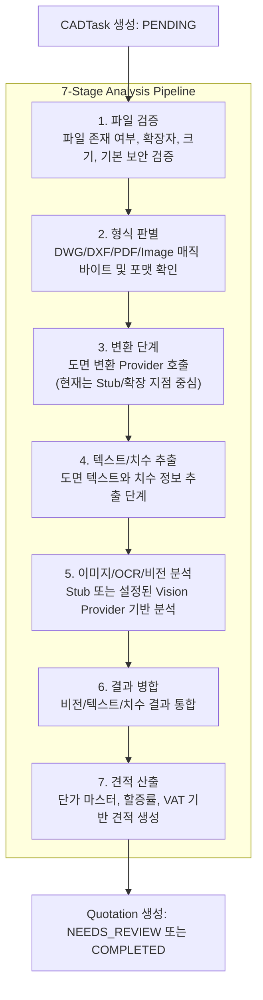

# CAD/DWG Estimate Application - System Architecture & Feature Map

본 문서는 **CAD/DWG 도면 가구 수량 분석 및 견적 자동화 솔루션**의 핵심 기능, 시스템 구조, 분석 파이프라인, 데이터 검증 정책 및 UI/UX 보완 사항을 정리합니다. 최신 샘플 데이터셋 보안 정책, optional local fixture 검증, path traversal 방어, 프론트엔드 샘플 상태 표시 개선 사항을 반영했습니다.

---

## 1. 전체 시스템 구성도

본 서비스는 분리된 **React SPA 프론트엔드**, **FastAPI 백엔드**, **SQLite DB**, **로컬 업로드 파일 시스템**, 그리고 개발/검증용 **Sample Manifest 및 Golden Fixture**로 구성됩니다.

### 파일 보안 및 형상 관리 정책

- **DWG 원본 파일 Git 추적 배제**
  설계 도면의 지식재산권 보호 및 대용량 바이너리 관리를 위해 원본 DWG 파일은 Git 추적 대상에서 제외합니다. `.gitignore`에 `*.dwg`를 적용했고, 기존에 추적되던 DWG도 Git 인덱스에서 제거했습니다. 로컬 파일은 삭제하지 않고 보안 저장소 또는 개발자 로컬 환경에서만 관리합니다.

- **민감 XLSX 및 파생 Golden JSON 비공개 유지**
  신규 현장 샘플의 원본 발주서 XLSX와 해당 파일에서 생성한 Golden JSON은 Git에 커밋하지 않습니다. 로컬에 파일이 존재하면 추가 회귀 검증을 수행하고, CI/외부 환경에서는 synthetic fixture와 공개 가능한 fixture 중심으로 검증합니다.

- **CI 안정화용 Fixture**
  민감 데이터 없이도 테스트가 동작하도록 `po_synthetic_sample.json` 같은 synthetic Golden Fixture를 사용합니다.

---

## 2. 7단계 분석 파이프라인

도면 업로드 후 백엔드 Background Task를 통해 `pipeline.py`의 분석 흐름이 실행됩니다. 현재 구현은 실제 CAD/AI 분석 엔진을 완성한 상태라기보다, **단계별 구조와 Stub/Provider 기반 확장 지점**을 갖춘 데모/파일럿 구조입니다.



> 대용량 DWG는 자동 테스트에서 전체 변환하지 않습니다. 테스트에서는 파일이 로컬에 존재할 때만 헤더(`AC10` 계열)와 manifest 메타데이터를 검증하고, 파일이 없으면 optional fixture로 처리합니다.

---

## 3. 데이터베이스 ERD 요약

핵심 엔티티는 다음과 같습니다.

```text
Project
  ├─ ApartmentType
  │    ├─ CabinetBOM
  │    │    └─ BuildingQuantity
  │    ├─ MaterialSpecification
  │    └─ HardwareSpecification
  ├─ CADTask
  │    └─ Quotation
  │         ├─ QuotationItem
  │         └─ QuotationItemAudit
  └─ Quotation

CabinetPriceMaster
  └─ 견적 산출 시 product/category 기준 단가 매칭
```

초안 ERD에는 `QuotationItemAudit`, `MaterialSpecification`, `HardwareSpecification`, `CabinetPriceMaster`가 빠져 있었으므로 보완하는 것이 정확합니다.

---

## 4. 모듈별 핵심 기능

### 1) 백엔드 API (`main.py`)

- `/api/samples`
  - `sample/manifest.json`을 읽어 샘플 목록을 반환합니다.
  - 각 샘플에 대해 서버 로컬 파일 존재 여부(`exists`)와 파일 크기(`file_size_mb`)를 동적으로 추가합니다.

- `/api/samples/import-po`
  - `.xlsx` 파일만 허용합니다.
  - `sample` 루트 밖 경로 접근을 차단합니다.
  - `../`, Windows 절대경로, 다른 드라이브 경로 등은 `400 Bad Request`로 처리합니다.
  - 존재하지 않는 파일은 `404`로 처리합니다.
  - 하위 폴더의 로컬 XLSX는 허용하지만, 해당 파일은 Git 커밋 대상이 아닙니다.

- `/api/tasks/upload`
  - 허용 확장자 및 매직 바이트를 검증합니다.
  - 기본 업로드 크기 제한은 `MAX_UPLOAD_SIZE` 설정을 따릅니다.
  - 대용량 DWG 샘플은 자동 업로드/변환 테스트 대상이 아닙니다.

### 2) 테스트 및 데이터 검증 (`tests/test_sample_assets.py`)

- **Manifest 스키마 검증**
  - `id`, `file_name`, `file_type`, `project_name`, `linked_purchase_order_file` 등 필수 필드를 검증합니다.
  - `file_type`은 허용된 값만 사용할 수 있습니다.

- **Optional Local Fixture 정책**
  - DWG와 민감 신규 XLSX는 로컬에 있으면 검증합니다.
  - 로컬에 없으면 CI에서 실패하지 않도록 skip/optional 처리합니다.
  - 공개 가능한 기존 fixture와 synthetic fixture는 항상 검증합니다.

- **DWG 헤더 검증**
  - 로컬 DWG가 존재하면 `AC10` 계열 매직 바이트와 manifest의 `dwg_version`을 비교합니다.
  - 로컬에 없으면 manifest 메타데이터만 검증합니다.

- **Known Source Data Gaps**
  - 포스코 아산탕정4BL `84C` item 22/23의 `qty_sum=1`, 동정보 수량 합계 `0` 이슈는 원본 데이터 결측으로 명시 관리합니다.
  - 이 검증은 해당 민감 샘플 XLSX가 로컬에 존재할 때만 수행됩니다.

### 3) 프론트엔드 UI (`frontend/src/App.jsx`)

- `/api/samples`에서 내려주는 `exists`, `file_size_mb`를 이용해 샘플 보유 상태를 표시합니다.
  - 파일 있음: `보유 (X.XXMB)`
  - DWG 없음: `보안 미보유 (Git 제외)`
  - XLSX 없음: `파일 없음`

- 파일이 없는 샘플은 `DB 임포트 실행`, `골든 데이터 평가 실행` 버튼을 비활성화합니다.

- 이 개선은 개발자/검증 도구 영역에서 “왜 어떤 샘플은 실행할 수 없는지”를 명확히 보여주는 UI/UX 보완입니다.

단, 초안의 “로딩/빈 상태 피드백 전반 적용”은 다소 넓은 표현입니다. 이번 작업 범위에서는 **샘플 검증 도구의 상태 표시 및 안전한 버튼 비활성화**가 핵심 개선입니다.

---

## 5. 수정된 표현 요약

- 공개 가능한 기존 fixture와 synthetic fixture만 Git에 포함하며, 신규 민감 샘플 XLSX와 해당 파일에서 파생된 Golden JSON은 Git에서 제외하고 로컬/보안 저장소에서만 관리합니다.
- 비전 분석 단계는 Stub 또는 설정 가능한 Vision Provider 기반 단계입니다. 실제 Gemini 등 외부 Vision Provider 연동은 provider 설정 및 구현 상태에 따라 달라집니다.
- 공개/필수 fixture는 존재를 검증하고, 민감 로컬 샘플은 존재 시 추가 검증하며 없으면 CI 안정성을 위해 optional 처리합니다.
